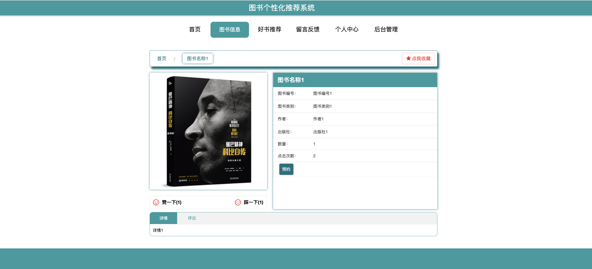

<h1 align="center">003.图书个性化推荐系统的设计与实现</h1>

	
    
    
    

## 简介

> 本代码仅供学习参考使用
> 
> 加QQ(1120041844)获取完整项目和论文
> 
> QQ群(931915467)入群后联系群主获取完整项目和论文
> 
>
>访问路径
>
> 前台地址:http://localhost:8080/springbootxs5o6/front/index.html
> 
> 后台地址:http://localhost:8080/springbootxs5o6/admin/dist/index.html#/index
>
> 密码 : abo abo

## 环境

- <b>IntelliJ IDEA 2009.3</b>

- <b>Mysql 5.7.26</b>

- <b>Tomcat 7.0.73</b>

- <b>JDK 1.8</b>

## 缩略图

## License

# [gitee主页查看更多毕业设计项目](https://gitee.com/jiananxu/projects)
# [github主页查看更多毕业设计项目](https://github.com/1120041844)

